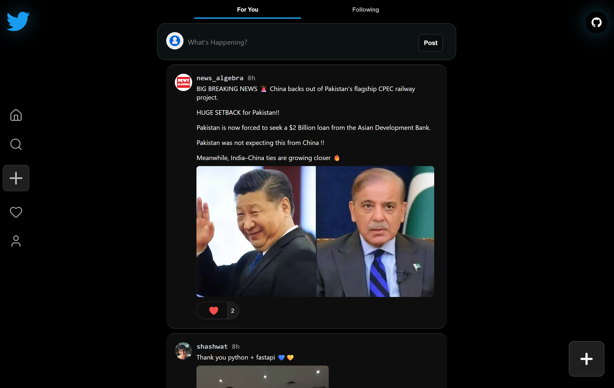
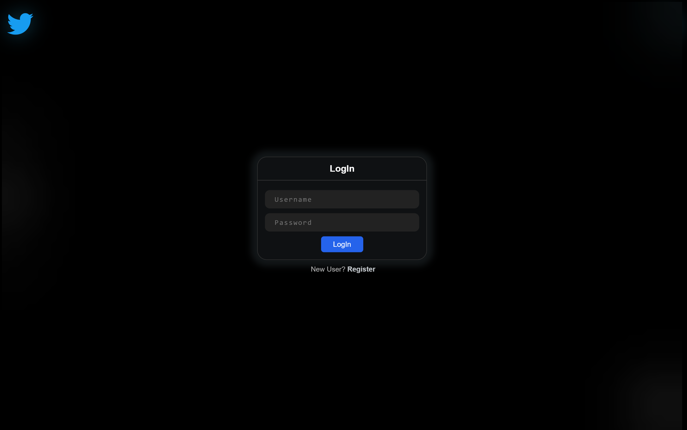
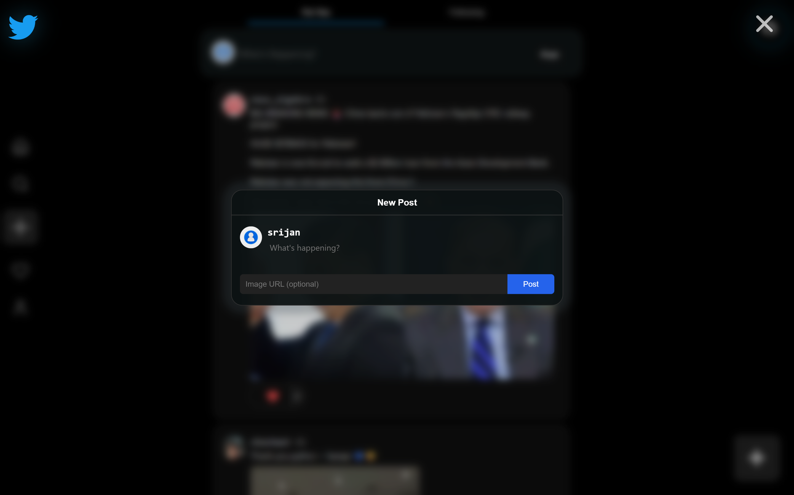

## Backend Repo- https://github.com/sawankshrma/threads-X (django)

## Overview

This is a twitter/threads like application made with React.
#### The ```prod``` branch exactly represents the original domain's contents
### Deployment

- It's currently deployed on an MS Azure VM @ https://x.sharmaji.space/
- The process spits a dist folder from which the assests are copied to the backend-repo's static folder, and `index.html` file is copied to templates/network folder.
- The backend repo now serves the dist files created from here..

- It uses the local `sqlite` database in the VM (for now)

### Tech Stack

- React.js
- Django
- sqlite
- JavaScript

### Demo Screenshots

| 🏠 Home Page             | 📱 Mobile Responsivenes          |
| ------------------------ | -------------------------------- |
|  |  |

| 🔑 Authentication              | ✍️ Creating a Post            |
| ------------------------------ | ----------------------------- |
|  |  |

```
 More Update Soon... (Do check it out at https://x.sharmaji.space/)
```
